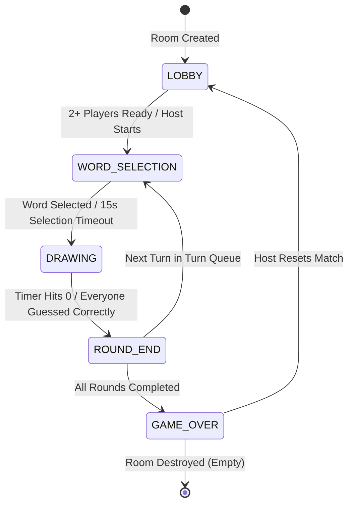

# ✍️ Doodle & Guess (skribbl.io Clone)

A high-performance, real-time, multiplayer drawing and guessing game built with **React**, **Node.js (Express)**, and **Socket.IO**. Designed from the ground up to demonstrate production-grade system architecture, strict Object-Oriented Programming (OOP) principles, scalable frontend structures, and responsive canvas scale-normalization.

---

## 🚀 Live Links & Tech Stack

* **Frontend Hosting (Vercel)**: `https://your-vercel-url.vercel.app` *(Replace with your actual Vercel link)*
* **Backend API (Render)**: `https://your-render-url.onrender.com` *(Replace with your actual Render link)*

### Tech Stack
* **Frontend**: React (ES6+ functional components) + Vite + Custom Hooks + CSS Grid/Flexbox
* **Real-time Sync**: Socket.IO Client
* **Backend**: Node.js + Express (ES Modules) + Socket.IO Server
* **Architecture**: Strict OOP State Engine (Encapsulated classes: `Room`, `Player`, `Timer`, `WordManager`, `Canvas`, `GameManager`)

---

## 🎨 System Design & Architecture

The application is structured around a real-time event-driven client-server model, utilizing a robust Object-Oriented state registry on the backend and single-responsibility functional components on the client.

### 1. Game State Lifecycle Diagram
The state transition engine guarantees automated round cycles, drawer rotations, selection countdowns, and cleanup flows:



---

### 2. Real-Time Synchronization Sequence Flow
This diagram illustrates the WebSocket event loop when a drawer picks a word, starts sketch operations, and a guesser submits a correct answer:

```mermaid
sequenceDiagram
    autonumber
    actor Drawer as Drawer (Client)
    actor Guesser as Guesser (Client)
    participant Server as Node.js Socket.IO Server
    
    Drawer->>Server: choose_word { word, roomId, playerId }
    Note over Server: Start Round Timer & Hints Interval
    Server-->>Drawer: round_start { isDrawer: true, wordOptions, drawTime }
    Server-->>Guesser: round_start { isDrawer: false, category, wordLength }
    
    rect rgb(30, 20, 60)
        Note over Drawer, Guesser: Canvas Drawing Synced Cycle
        Drawer->>Server: draw_start { x, y, color, size }
        Server-->>Guesser: draw_data { ...strokeData }
        Drawer->>Server: draw_move { x, y }
        Server-->>Guesser: draw_data { ...strokeData }
        Drawer->>Server: draw_end
    end
    
    Guesser->>Server: guess { text }
    Note over Server: Check guess against secret word
    Server-->>Guesser: guess_result { correct: true, points }
    Server-->>Drawer: guess_result { correct: true, drawerPoints }
    Server-->>Server: Check if everyone has guessed correctly
    Server-->>Drawer: round_end { word, scores, nextDrawer }
    Server-->>Guesser: round_end { word, scores, nextDrawer }
```



---

### 3. Canvas Coordinate Scale Normalization (System Math)
A major engineering challenge in online whiteboards is **device screen resolution differences**. If a player draws on a 1080p desktop screen and another player views it on a mobile device, the strokes will display offset or cut off unless scaled.

#### The Solution:
Our application implements a resolution-independent scaling grid.
1. The drawing canvas coordinate space is mapped to a fixed logical coordinate system of **`800x500` pixels** on the server.
2. When the drawer draws a line, client coordinates are mapped using the bounding rect offset ratio before sending them to the socket server:
   $$\text{Normalized } X = \frac{\text{client } X - \text{rect.left}}{\text{rect.width}} \times 800$$
   $$\text{Normalized } Y = \frac{\text{client } Y - \text{rect.top}}{\text{rect.height}} \times 500$$
3. When the guesser receives coordinates from the server, they scale the line back to match their local screen aspect ratio:
   $$\text{Render } X = \frac{\text{Normalized } X}{800} \times \text{local canvas width}$$
   $$\text{Render } Y = \frac{\text{Normalized } Y}{500} \times \text{local canvas height}$$

This guarantees that drawings are perfectly aligned, clean, and proportional on all screens, from huge monitors to smartphone displays.

---

## 🛠️ Object-Oriented Backend Engine

The backend isolates game mechanics into dedicated classes rather than packing scripts into massive route handlers:

* **`Player.js`**: Houses player socket references, score totals, ready states, drawer flags, and JSON converters.
* **`Room.js`**: Coordinates the active lobby lifecycle, controls the active state transitions, triggers round rotations, and coordinates point awards using a time-decay algorithm.
* **`Timer.js`**: A tick-based callback clock encapsulating `setInterval` loops to manage active gameplay countdowns.
* **`WordManager.js`**: Fetches randomized words, splits them by category, handles spelling checkers, and maps the `usedWords` registry to avoid word repetition in a session.
* **`Canvas.js`**: Holds active drawing history paths so players joining mid-round can receive current boards instantly.
* **`GameManager.js`**: Centralized mapping table managing room insertions, exits, public matchmaking, and statistics monitors.

---

## 💻 Modular Frontend Organization

We separated the monolithic codebase into structured React components and custom hooks:

```
Frontend/src/
├── components/
│   ├── Modals/
│   │   ├── GameOverModal.jsx       # Champion podium crowned at end
│   │   ├── RoundEndModal.jsx       # Reveals correct word + round scores
│   │   └── WordSelectionModal.jsx  # Pulse-glow selection panel
│   ├── CanvasBoard.jsx             # Canvas frame + Brush/Color/Eraser toolbar
│   ├── ChatPanel.jsx               # Guesses list + messages input filter
│   ├── LeaderboardSidebar.jsx      # Live player scoring ranks
│   ├── LobbySelect.jsx             # skribbl.io home page + rules list
│   └── WaitingLobby.jsx            # Ready up + configuration panel
├── context/
│   └── SocketContext.jsx           # Core WebSocket context layer & emitters
├── hooks/
│   └── useCanvas.js                # Custom whiteboard logic, scales & undoes
├── App.jsx                         # Screen router (Lobby -> Waiting -> Game)
└── index.css                       # Dark theme + ambient orbs keyframe styles
```

---

## 🔗 Socket Events API Reference

### Room & Matchmaking
* `create_room` (Client ➡️ Server) | Payload: `{ hostName, settings: { maxPlayers, rounds, drawTime, type, wordMode } }`
* `join_room` (Client ➡️ Server) | Payload: `{ roomId, playerName }`
* `join_public_room` (Client ➡️ Server) | Payload: `{ playerName }` *(Finds active public room or spawns one)*
* `room_created` (Server ➡️ Client) | Payload: `{ roomId, playerId, room }`
* `room_joined` (Server ➡️ Client) | Payload: `{ roomId, playerId, room }`
* `player_joined` (Server ➡️ Client) | Payload: `{ player, players }`
* `leave_room` (Client ➡️ Server) | Resets context states on exit
* `player_left` (Server ➡️ Client) | Payload: `{ playerId, players }`

### Game Loop Events
* `start_game` (Client ➡️ Server) | Initiates round 1 (Host/Auto-Matchmaker only)
* `game_started` (Server ➡️ Client) | Transitions screen routers to `GAME_PLAY`
* `round_start` (Server ➡️ Client) | Payload: `{ drawerId, wordOptions, room }` *(Starts word selection)*
* `word_chosen` (Client ➡️ Server) | Payload: `{ word, roomId, playerId }` *(Starts draw clock)*
* `round_end` (Server ➡️ Client) | Payload: `{ word, scores, nextDrawer }`
* `game_over` (Server ➡️ Client) | Payload: `{ winner, leaderboard }`
* `play_again` (Client ➡️ Server) | Payload: `{ roomId, playerId }` *(Resets room state for another match)*

### Drawing Sync Events
* `draw_start` (Client ➡️ Server) | Payload: `{ x, y, color, size }`
* `draw_move` (Client ➡️ Server) | Payload: `{ x, y }`
* `draw_end` (Client ➡️ Server)
* `draw_data` (Server ➡️ Client) | Broadcasts drawing coordinates to guessers
* `canvas_clear` (Client ➡️ Server) | Clears canvas for all connected players
* `draw_undo` (Client ➡️ Server) | Pops last path and updates guessers' whiteboard

### Chat & Guessing
* `guess` (Client ➡️ Server) | Payload: `{ text }` *(Guess submission check)*
* `guess_result` (Server ➡️ Client) | Payload: `{ correct: true/false, playerId, username, points }`
* `chat` (Client ➡️ Server) | Payload: `{ text }` *(Sends standard messages)*
* `chat_message` (Server ➡️ Client) | Broadcasts general message to chat panel

---

## ⚡ Local Setup & Execution

### 1. Prerequisites
Ensure you have **Node.js (v18+)** installed.

### 2. Backend Server Setup
1. Navigate to the backend directory:
   ```bash
   cd Backend
   ```
2. Install dependencies:
   ```bash
   npm install
   ```
3. Set up environment variables. Create a `.env` file:
   ```env
   PORT=5000
   ```
4. Start the server:
   ```bash
   npm start
   ```
   *Server will run at `http://localhost:5000`.*

### 3. Frontend Client Setup
1. Open a new terminal and navigate to the frontend directory:
   ```bash
   cd Frontend
   ```
2. Install dependencies:
   ```bash
   npm install
   ```
3. Start the Vite dev server:
   ```bash
   npm run dev
   ```
   *Client will open at `http://localhost:5173`.*

---

## 🛡️ Global Exception Handling & Stability
The backend server contains global error event guards configured directly in the process scope:
* **`uncaughtException`**: Catches runtime errors (e.g. database disconnects) to prevent the server process from crashing.
* **`unhandledRejection`**: Intercepts failed asynchronous Promise calls, logging error stack traces without disrupting active room game loops.
